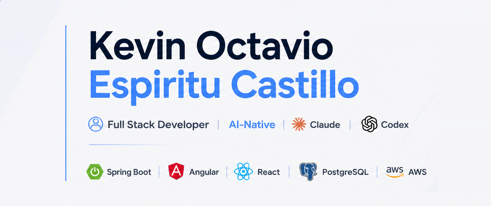

## Sobre mí

Soy **Full Stack Developer** y estudiante de Ingeniería de Sistemas, enfocado en desarrollar soluciones web prácticas, escalables y mantenibles.

Trabajo principalmente en el desarrollo de **aplicaciones web, APIs REST e integraciones con bases de datos**, utilizando tecnologías como **Spring Boot, Angular, React y PostgreSQL**, además de servicios de **AWS** para despliegue e infraestructura en la nube.

He participado en proyectos empresariales, académicos y personales, desarrollando soluciones para gestión de inventario y ventas, automatización de procesos, integración de servicios externos y facturación electrónica.

Complemento mi flujo de trabajo con un enfoque **AI-Native**, utilizando herramientas como **OpenAI Codex y Claude Code** en procesos de planificación, implementación, documentación, revisión de código, QA y pruebas, manteniendo la revisión y validación técnica de los resultados.

Actualmente busco seguir desarrollándome profesionalmente en **Full Stack Development e Ingeniería de Software**, aplicando un enfoque AI-Native durante el ciclo de desarrollo.

## Stack principal

<table>
  <tr>
    <td align="center" width="115"> <b>Spring Boot</b></td>
    <td align="center" width="115"> <b>Angular</b></td>
    <td align="center" width="115"> <b>React</b></td>
    <td align="center" width="115"> <b>PostgreSQL</b></td>
    <td align="center" width="115"> <b>AWS</b></td>
  </tr>
</table>

## Desarrollo AI-Native

Estructuro este enfoque con agentes y skills especializados para cada etapa del ciclo, incluyendo decisiones de arquitectura y análisis de seguridad.

## Lo que construyo

- Aplicaciones web full stack
- Servicios backend y APIs REST
- Sistemas basados en bases de datos
- Integraciones con APIs de terceros
- Flujos de automatización
- Aplicaciones desplegadas en la nube

## Contacto

- **LinkedIn:** [kevin-espiritu](https://www.linkedin.com/in/kevin-espiritu/)
- **Email:** [kevinespiritu16@gmail.com](mailto:kevinespiritu16@gmail.com)
