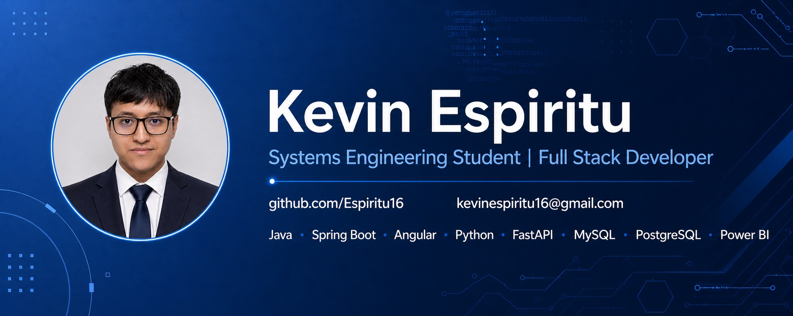

I'm a Systems Engineering student and Full Stack Developer focused on building practical and scalable software solutions. I enjoy working across the stack with Java, Spring Boot, Angular, Python, and relational databases, while continuously improving my approach to software design and development.

My experience comes from academic projects, business solutions, and personal projects created to learn, experiment, and turn ideas into useful applications. Through these projects, I have worked with backend services, REST APIs, web modules, database integrations, automation, and data visualization.

I'm open to collaborating on software projects and contributing to backend development, API integrations, automation, and web applications.

**email:** kevinespiritu16@gmail.com
